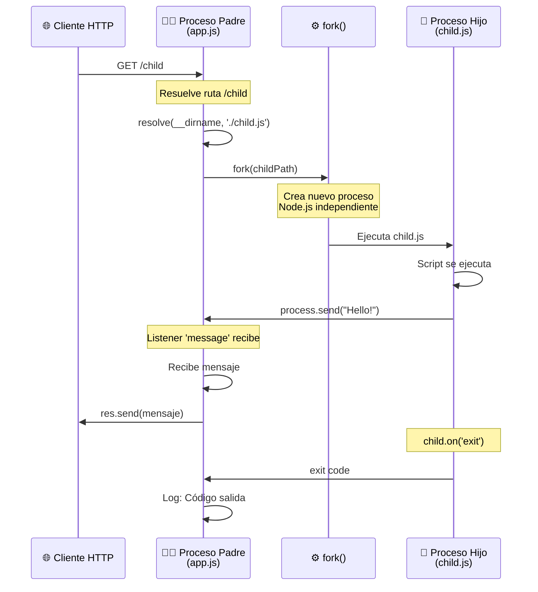
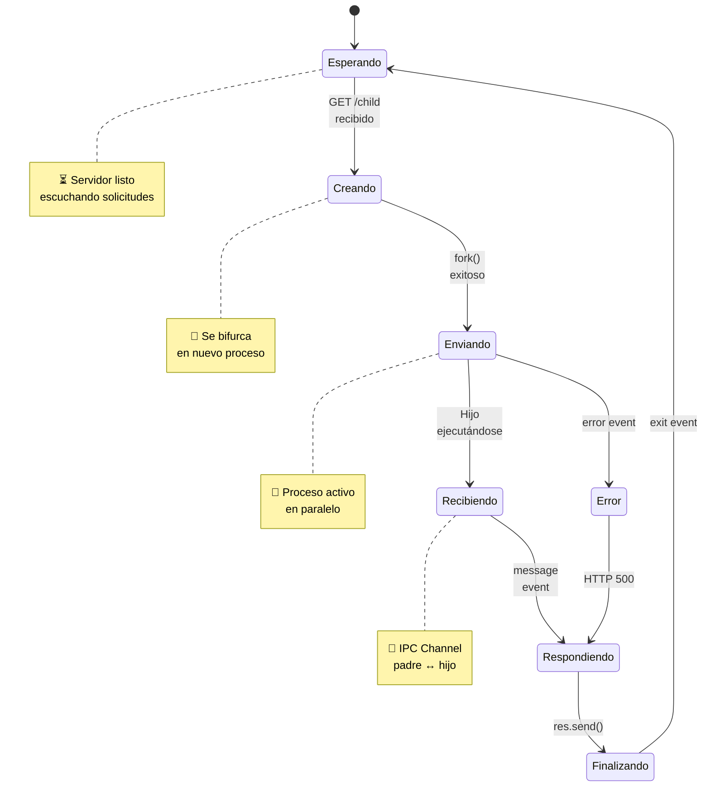
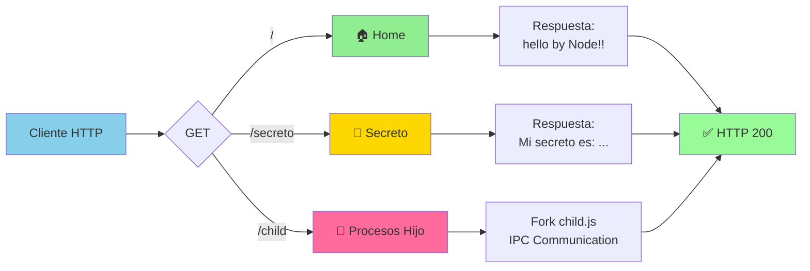
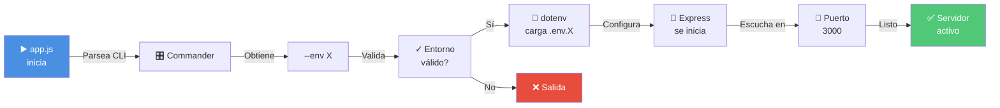
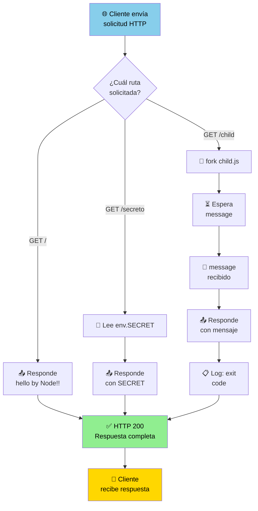
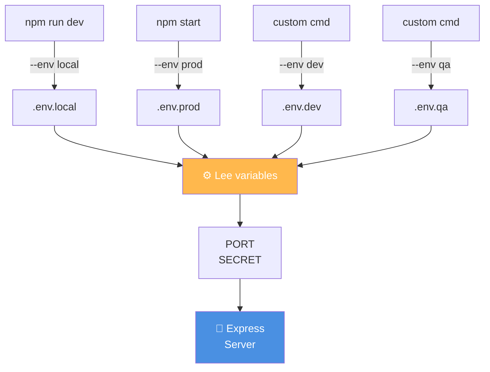
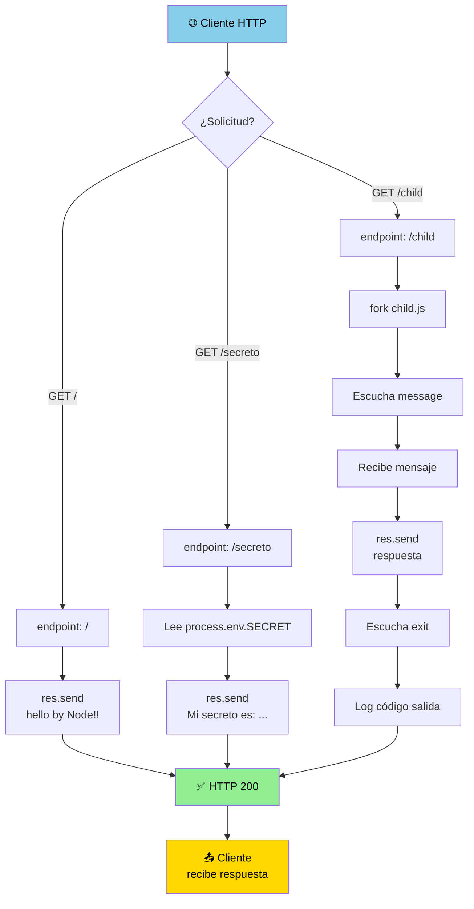

# 🚀 Back3_77325 - Servidor Express con Procesos Hijo

Una aplicación backend construida con **Node.js** y **Express.js** que demuestra la comunicación entre procesos padre e hijo usando el patrón de `fork()`, junto con gestión de configuración por entorno.

## 📋 Descripción del Proyecto

Esta aplicación es un servidor HTTP que implementa:
- ✅ Gestión de configuración por entorno (local, dev, prod, qa)
- ✅ Comunicación inter-procesos mediante `fork()` de Node.js
- ✅ Manejo de variables de entorno con seguridad
- ✅ CLI con opciones de línea de comandos usando Commander
- ✅ API REST simple con Express

---

## 📑 Tabla de Contenidos
1. [Arquitectura de la Aplicación](#arquitectura-de-la-aplicación)
2. [Flujo de Procesos Hijo](#flujo-de-procesos-hijo)
3. [Rutas de la API](#rutas-de-la-api)
4. [Instalación y Uso](#instalación-y-uso)
5. [Dependencias](#dependencias)

---

## 🏗️ Estructura del Proyecto

```
Back3_77325/
├── app.js                 # Archivo principal del servidor (proceso padre)
├── child.js              # Script del proceso hijo
├── package.json          # Configuración del proyecto y dependencias
├── .env.local            # Variables de entorno para desarrollo local
├── .env.dev              # Variables de entorno para desarrollo
├── .env.qa               # Variables de entorno para QA
├── .env.prod             # Variables de entorno para producción
├── LICENCE               # Licencia del proyecto
└── README.md             # Este archivo
```

---

## 🏛️ Arquitectura de la Aplicación

### Descripción General

La aplicación utiliza una **arquitectura cliente-servidor** con capacidad de procesamiento paralelo mediante procesos hijo. El servidor principal (app.js) actúa como proceso padre que puede bifurcarse en procesos hijo (child.js) cuando es necesario ejecutar operaciones complejas sin bloquear el hilo principal.

### 📊 Esquema General de Arquitectura

```mermaid
graph TB
    subgraph "Proceso Principal (app.js)"
        A["🔧 Express Server<br/>PID: Padre"]
        B["🛣️ Routes Handler"]
        C["⚙️ Environment Manager<br/>dotenv + Commander"]
    end
    
    subgraph "Procesos Hijo (child.js)"
        D["👶 Child Process<br/>PID: Hijo"]
        E["💬 process.send()"]
    end
    
    subgraph "Cliente HTTP"
        F["🌐 Cliente HTTP<br/>navegador/API"]
    end
    
    F -->|Solicitud HTTP| A
    A --> B
    B -->|fork()| D
    D --> E
    E -->|'message' event| B
    B -->|Respuesta HTTP| F
    C -.->|Configura| A
    
    style A fill:#4A90E2,stroke:#2E5C8A,color:#fff
    style B fill:#50C878,stroke:#2E7D4E,color:#fff
    style C fill:#FFB84D,stroke:#CC8A00,color:#fff
    style D fill:#E573F2,stroke:#B300D9,color:#fff
    style E fill:#E89BA0,stroke:#CC5A67,color:#fff
    style F fill:#87CEEB,stroke:#4A90B5,color:#fff
```

---

## 🔄 Flujo de Procesos Hijo

### Cómo Funciona la Comunicación entre Procesos

Cuando se accede a la ruta `/child`, el servidor realiza los siguientes pasos de comunicación entre procesos:

### 📡 Esquema Secuencial de Comunicación Padre-Hijo



### 🎯 Estados de Comunicación



---

## 🛣️ Rutas de la API

### 📊 Mapeo de Rutas



### 1️⃣ `GET /` - Home
**Descripción:** Endpoint raíz que confirma que el servidor está funcionando.

```
✅ Método: GET
📍 Ruta: /
📤 Respuesta: "hello by Node!!"
🔌 Status: 200 OK
```

**Ejemplo:**
```bash
curl http://localhost:3000/
```

---

### 2️⃣ `GET /secreto` - Obtener Secreto
**Descripción:** Retorna el valor de la variable de entorno `SECRET`.

```
✅ Método: GET
📍 Ruta: /secreto
📤 Respuesta: "Mi secreto es: "<valor_del_SECRET>""
🔌 Status: 200 OK
```

**Ejemplo:**
```bash
curl http://localhost:3000/secreto
```

---

### 3️⃣ `GET /child` - Ejecutar Proceso Hijo
**Descripción:** Crea un proceso hijo independiente que envía un mensaje al proceso padre mediante IPC.

```
✅ Método: GET
📍 Ruta: /child
📤 Respuesta: "Mensaje del proceso hijo: "Hello from your son!!""
🔌 Status: 200 OK
```

**Proceso Detallado:**
1. El servidor llama a `fork()` con la ruta de `child.js`
2. Se crea un nuevo proceso Node.js independiente
3. El proceso hijo ejecuta `process.send()` para comunicarse
4. El padre escucha el evento `'message'` y responde al cliente
5. El proceso hijo finaliza automáticamente

**Ejemplo:**
```bash
curl http://localhost:3000/child
```

**Manejo de Errores:**
- Si ocurre un error: Status 500
- Se registra el código de salida del proceso hijo en consola

---

## 🔧 Cómo Funciona la Aplicación

### 1️⃣ Inicialización de la Aplicación



### 2️⃣ Ciclo de Vida de una Solicitud



### 3️⃣ Estructura de Configuración por Entorno



---

## 📦 Dependencias

### Producción
| Dependencia | Versión | Uso |
|------------|---------|-----|
| **express** | ^4.18.2 | Framework HTTP/REST |
| **dotenv** | ^16.0.3 | Gestión de variables de entorno |
| **commander** | 14.0.3 | CLI y parseo de argumentos |

### Desarrollo
| Dependencia | Versión | Uso |
|------------|---------|-----|
| **nodemon** | 3.1.14 | Monitor de cambios automático |

---

## 🚀 Instalación y Uso

### Requisitos Previos
- Node.js >= 14.x
- npm >= 6.x

### Pasos de Instalación

1. **Clona o descarga el proyecto:**
```bash
cd /home/gustavo/Documentos/Back3_77325
```

2. **Instala las dependencias:**
```bash
npm install
```

3. **Crea los archivos de entorno:**
```bash
# Ejemplo para desarrollo local
cat > .env.local << EOF
PORT=3000
SECRET=MiSecretoLocal
EOF

# Ejemplo para desarrollo
cat > .env.dev << EOF
PORT=3001
SECRET=MiSecretoDev
EOF

# Ejemplo para QA
cat > .env.qa << EOF
PORT=3002
SECRET=MiSecretoQA
EOF

# Ejemplo para producción
cat > .env.prod << EOF
PORT=80
SECRET=MiSecretoProduccion
EOF
```

### Ejecución

#### Modo Desarrollo (Con auto-recarga)
```bash
npm run dev
# Equivalente a: nodemon app.js --env local
```

#### Modo Producción
```bash
npm start --env prod
# Equivalente a: node app.js --env prod
```

#### Especificar Entorno
```bash
npm start --env qa
npm start --env dev
npm start --env local
```

---

## 📝 Casos de Uso

### Caso 1: Desarrollo Local
```bash
npm run dev
# El servidor inicia con .env.local
# http://localhost:3000
```

### Caso 2: Probar Procesos Hijo
```bash
curl http://localhost:3000/child
# Respuesta: "Mensaje del proceso hijo: "Hello from your son!!""
```

### Caso 3: Obtener Información de Configuración
```bash
curl http://localhost:3000/secreto
# Lee la variable SECRET del entorno actual
```

---

## 🔐 Variables de Entorno Soportadas

| Variable | Obligatoria | Valor por Defecto | Descripción |
|----------|-------------|-------------------|-------------|
| **PORT** | ❌ No | 3000 | Puerto en el que escucha el servidor |
| **SECRET** | ❌ No | "Secreto" | Valor secreto que se puede consultar |

**Nota:** Si existe un puerto en `.env.X` que no es válido numéricamente, la aplicación mostrará un error y no iniciará.

---

## 🎯 Conceptos Clave Implementados

### 1. **Procesos Hijo (Child Processes)**
- Uso de `fork()` para crear procesos Node.js independientes
- Comunicación IPC (Inter-Process Communication) mediante `process.send()`
- Manejo de eventos: `message`, `error`, `exit`

### 2. **Gestión de Entornos**
- Soporta múltiples entornos: local, dev, qa, prod
- Validación de entornos permitidos
- Carga selectiva de `.env.X` según el entorno

### 3. **CLI con Commander**
- Parseo de argumentos CLI: `--env` o `-e`
- Opciones con valores por defecto
- Manejo de errores de entrada

### 4. **Manejo de Errores**
- Validación de archivos `.env.X` existentes
- Validación de números en variables de entorno
- Gestión de errores en procesos hijo
- Handlers de Express para todas las rutas

---

## 🔍 Detalles Técnicos

### IPC (Inter-Process Communication)
La comunicación entre el proceso padre y el hijo se realiza a través de un canal IPC automático creado por `fork()`:

```javascript
// Padre: Escucha eventos del hijo
child.on('message', (msj) => { ... })
child.on('error', (error) => { ... })
child.on('exit', (code) => { ... })

// Hijo: Envía mensajes al padre
process.send("Hello from your son!!");
```

### Resolución de Rutas en ES6
Se utiliza `import.meta.url` con `fileURLToPath` para obtener el directorio actual:
```javascript
const __filename = fileURLToPath(import.meta.url);
const __dirname = dirname(__filename);
```

---

## 📊 Diagrama Completo del Flujo de Ejecución



---

## 🤝 Contribuciones

Este proyecto es parte del curso de Backend en Coder House. Para mejoras, proporciona feedback a través de los issues.

---

## 📄 Licencia

MIT - Ver archivo `LICENCE` para más detalles.

---

## 👤 Autor

**Gustavo Billoud**
- GitHub: [GusBilloud](https://github.com/GusBilloud)
- Repositorio: [Back3_77325](https://github.com/GusBilloud/Back3_77325)

---

## ℹ️ Más Información

Para entender mejor cómo funcionan los procesos hijo en Node.js:
- [Documentación oficial: Child Process](https://nodejs.org/api/child_process.html)
- [IPC en Node.js](https://nodejs.org/api/child_process.html#child_process_options_stdio)
- [Express.js Documentation](https://expressjs.com/)
